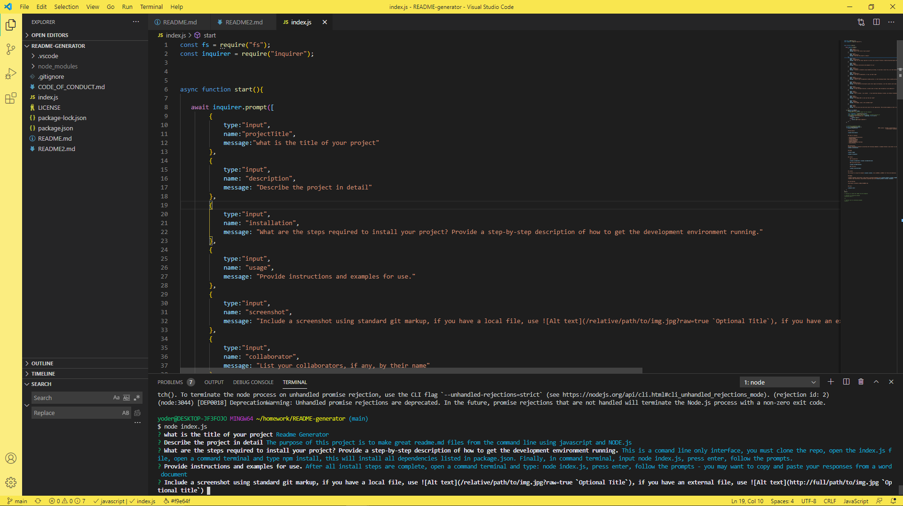

# dan   
    #### License: 
    
                                                                                        
        ## Description
    
        i do stuff

        
        ## Table of Contents

        - [Installation](#Installation)
        - [Usage](#Usage)
        - [Credits](#credits)
        - [license](#license)
        - [Badges](#Badges)
        - [Contributing](#Contributing)
        - [Tests](#Tests)
        
        
        ## Installation
        Install Contributor Covenant by executing the following commands in command terminal: npm install -g covgen; covgen "<your_email_address>"
        get all of the things, then do them
    

        ## Usage 
    
        do the things i just told you to do
        
        

        
        ## Credits

            ### Collaborators
        
            dave https://github.com/dyoder838

            ### Third Party Assets
        
            none

            ### Tutorials 
        
            neon

        
        ## License

        This project is using the standard MIT License. See [LICENSE](.LICENSE) for Terms and Conditions.

        ## Badges

        
        

        
        ## Contributing

        [Contributor Covenant](.CODE_OF_CONDUCT.md)
        
        
        ## Tests

        not today